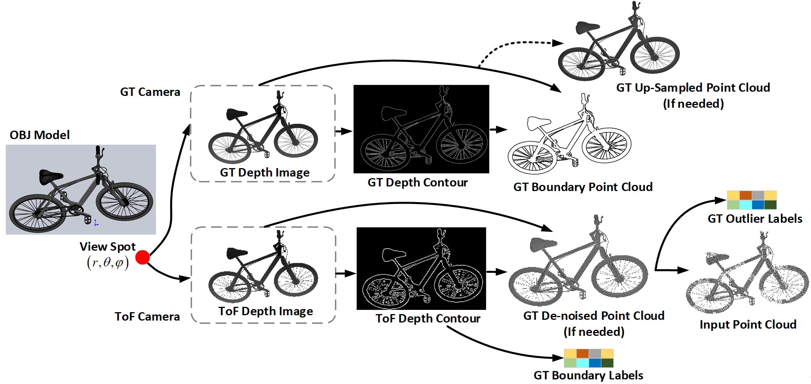

#  Bound57 Dataset



## Introduction

**Bound57** is a point cloud dataset designed for a variety of 3D point cloud processing tasks, including:

- ✅ Outlier Removal  
- ✅ Boundary Detection  
- ✅ Boundary Smoothing  
- ✅ Overall Denoising  
- ✅ Point Cloud Upsampling  
- ✅ Point Cloud Completion

It is suitable for research in wind tunnel experiments, depth sensor modeling, and general 3D perception tasks.

---

##  Available Data
Generated dataset available at: https://ssy-pcdatasets.oss-cn-hangzhou.aliyuncs.com/Bound57  
The downloaded Bound57 dataset contains the following files:

- `input.pcd`: Noisy point cloud, typically from a simulated Time-of-Flight (ToF) camera  
- `gt.pcd`: Ground truth smoothed boundary, generated from orthographic projection  
- `label.npy`: Per-point labels including **outlier** and **projection boundary** annotations

> Currently, only labels for outliers, projected boundaries, and smoothed boundaries are included.

---

##  Generate Custom Datasets

To support tasks such as completion, denoising, and upsampling, you can generate your own dataset using ShapeNetCore.v1 models.

### Step 1: Download ShapeNetCore.v1

Please follow instructions in the [`README.md`](README.md) to download and extract:

- [https://huggingface.co/datasets/ShapeNet/ShapeNetCore-archive/tree/main](https://huggingface.co/datasets/ShapeNet/ShapeNetCore-archive/tree/main)

The expected structure after extraction:  
 data/ShapeNetCore/  
 ├── 02691156/  
 │ ├── 1a6ad7a24bb89733f412783097373bdc/  
 │ │ └── model.obj  
 │ ├── ...  
 ├── 02958343/  
 │ ├── <model_id>/   
 │ │ └── model.obj
 ...  

---

### Step 2: Modify Configuration

Edit the generation configuration file at **`datagen/Bound57gen.json`** to adjust:
- complete_points
- number of points of view  
- camera distance ranges  
- camera pixel size
- what file to generate

---

### Step 4: Generate the dataset

Once you have completed the configuration, run the full dataset generation pipeline with:

```bash
python datagen.py
```
This script will:  

- Process all categories and models from the source_dir 
- Create multi-view point cloud data under data/Bound57/train, val, and test  

Before running the full generator, you can test the pipeline using a single model:

```bash
python datagen/singledatagen.py
```
This uses the example model located at **`datagen/example`**. The results will be saved in the same folder.

To use your own .obj file, modify the following line in **`datagen/singledatagen.py`**:
```bash
object_file_path = "your_path/your_model.obj"
```
---

### Step 6: Generate dataset JSON

Once all of the data is generated, create the dataset metadata file:

```bash
python datagen/jsongen.py
```
This will generate: **`data/Bound57/Bound57.json`**

This file contains:  

- A list of all samples  
- Their category, model ID  
- Train/val/test split  

The dataset loader will use this JSON to index and organize the data.
